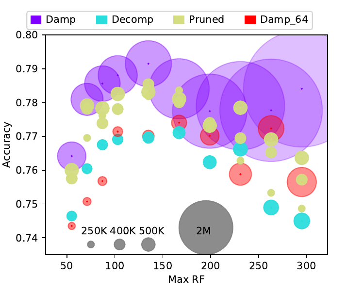

# CP JKU Submission for DCASE 2020

[](https://colab.research.google.com/github/kkoutini/cpjku_dcase20/blob/master/cpjku_dcase20_colab.ipynb)

Technical report [DCASE](http://dcase.community/documents/challenge2020/technical_reports/DCASE2020_Koutini_142.pdf). 
Workshop paper with more analysis of the parameter reduction methods [DCASE](http://dcase.community/documents/workshop2020/proceedings/DCASE2020Workshop_Koutini_91.pdf).
This Repo code is based on [CP JKU Submission for DCASE 2019](https://github.com/kkoutini/cpjku_dcase19). 
The architectures are based on Receptive-Field-Regularized CNNs  [The Receptive Field as a Regularizer in Deep Convolutional Neural Networks for Acoustic Scene Classification]( https://arxiv.org/abs/1907.01803), [Receptive-Field-Regularized CNN Variants for Acoustic Scene Classification](https://arxiv.org/abs/1909.02859)

Feel free to raise an issue or contact the authors in case of an issue.

## Colab notebook

[](https://colab.research.google.com/github/kkoutini/cpjku_dcase20/blob/master/cpjku_dcase20_colab.ipynb)

`cpjku_dcase20_colab.ipynb` contains the required code to run feature extraction and training on google colab. It also contains a low-complexity baseline (65K non-zero parameters) for DCASE 21 task 1.a with `0.623` accuracy.

## Requirements

[Conda]( https://conda.io/projects/conda/en/latest/user-guide/install/index.html?highlight=conda ) should be installed on the system.

```install_dependencies.sh``` installs the following:
* Python 3
* PyTorch  
* torchvision
* [tensorboard-pytorch]( https://github.com/lanpa/tensorboard-pytorch )
* etc..

## Installation
* Install [Anaconda](https://www.anaconda.com/) or conda

* Run the install dependencies script:
```bash
./install_dependencies.sh
```
This creates conda environment ```cpjku_dcase20``` with all the dependencies.

Running
``` source activate cpjku_dcase20``` is needed before running ```exp*.py```


## Usage
After installing dependencies:

- Activate Conda environment created by ```./install_dependencies.sh```
    ```bash
    $ source activate cpjku_dcase20
    ```

- Download the dataset:
    ```bash
    $ python download_dataset.py --version 2020b
    ```
    You can also download previous versions of DCASE ```--version year```, year is one of 2018,2017,2016,2019,2020a or any dataset from [dcase_util](https://dcase-repo.github.io/dcase_util/datasets.html).
    
    Alternatively, if you already have the dataset downloaded:
    - You can make link to the dataset: 
    ```bash
    ln -s ~/some_shared_folder/TAU-urban-acoustic-scenes-2019-development ./datasets/TAU-urban-acoustic-scenes-2019-development
    ```
    
    - Change the paths in ```config/[expermient_name].json```.
    
- Run the experiment script:
    ```
    $ CUDA_VISIBLE_DEVICES=0 python exp_[expeirment_name].py 
    ```
- The output of each run is stored in ``outdir``, you can also monitor the experiments with TensorBoard, using the logs stored in the tensorboard runs dir ```runsdir```. 
 Example: 
     ```bash
     tensorboard --logdir   ./runsdir/cp_resnet/exp_Aug20_14.11.28
     ```
 The exact commmand is printed when you run the experiment script.


## Example runs
default adapted receptive field RN1,RN1 (in Koutini2019Receptive below):
```bash 
$ CUDA_VISIBLE_DEVICES=0 python exp_cp_resnet.py 
```
For a list of args:
```bash 
$ CUDA_VISIBLE_DEVICES=0 python exp_cp_resnet.py --help
```

Large receptive Field
```bash 
$ CUDA_VISIBLE_DEVICES=0 python exp_cp_resnet.py  --rho 15
```
very small max receptive Field:

```bash 
$ CUDA_VISIBLE_DEVICES=0 python exp_cp_resnet.py  --rho 2
```
### Using differnet architectures
The argument ```--arch``` allows changing the CNN architecture, the possible architectures are stored in ```models/```.


For example [Frequency aware CP_ResNet](https://arxiv.org/abs/1909.02859) : 

```bash
CUDA_VISIBLE_DEVICES=0  python exp_cp_resnet.py --arch cp_faresnet  --rho 5

```
[Frequency-Damped](http://dcase.community/documents/workshop2020/proceedings/DCASE2020Workshop_Koutini_91.pdf) CP_ResNet:
```bash
CUDA_VISIBLE_DEVICES=0  python exp_cp_resnet.py --arch cp_resnet_freq_damp  --rho 7

```

Using  smaller width :
```bash
CUDA_VISIBLE_DEVICES=0 python3 exp_cp_resnet.py  --width 64   --rho 5
```
and removing some of the tailing layers :
```bash
CUDA_VISIBLE_DEVICES=0  python3 exp_cp_resnet.py  --width 64 --depth_restriction "0,0,3"  --rho 5
```
and pruning 90% of the parameters :
```bash
CUDA_VISIBLE_DEVICES=0 python3 exp_cp_resnet.py --arch  cp_resnet_prune  --rho 5  --width 64 --depth_restriction "0,0,3" --prune --prune_ratio=0.9
```

### CP_ResNet Submissions to DCASE 2020 Task 1b

Submission 1: Decomposed CP-ResNet(rho=3) with 95.83 accuracy on the development set (94.7 on the unseen evaluation set) 18740 trainable parameters (34.21875 KB in float16)

```bash 
$ CUDA_VISIBLE_DEVICES=0 python exp_cp_resnet.py --arch cp_resnet_decomp --rho 3  --width 48 --depth_restriction "0,4,4" 
```

Submission 2: Pruned Frequency-Damped CP-ResNet (rho=4) with 97.3 accuracy on the development set (96.5 on the unseen evaluation set) 250000 trainable parameters (500 KB in float16)

```bash 
$ CUDA_VISIBLE_DEVICES=1 python exp_cp_resnet.py --arch cp_resnet_df_prune --rho 4  --width 64 --depth_restriction "0,2,4" --prune --prune_method=all  --prune_target_params 250000
```

Submission 3:  Frequency-Damped CP-ResNet (width and depth restriction) (rho=4) with 97.3 accuracy on the development set (96.5 on the unseen evaluation set) 247316 trainable parameters (500 KB in float16)

```bash 
$ CUDA_VISIBLE_DEVICES=2 python exp_cp_resnet.py --arch cp_resnet_freq_damp --rho 4  --width 48 --depth_restriction "0,1,3"
```


### Reproducing Results from the [paper](http://dcase.community/documents/workshop2020/proceedings/DCASE2020Workshop_Koutini_91.pdf) with DCASE 18 Dataset

The plots uses different values of rho, in the examples we set rho=0.


Baseline CP-ResNet:

```bash 
$ CUDA_VISIBLE_DEVICES=0 python exp_cp_resnet.py --dataset dcase2018.json --arch cp_resnet  --depth_restriction "0,1,4" --rho 0 
```
CP-ResNet with Frequency-Damped layers:
```bash 
$ CUDA_VISIBLE_DEVICES=0 python exp_cp_resnet.py --dataset dcase2018.json --arch cp_resnet_freq_damp  --depth_restriction "0,1,4" --rho 0 
```

CP-ResNet Decomposed with decomposition factor of 4 (--decomp_factor 4):
```bash 
$ CUDA_VISIBLE_DEVICES=0 python exp_cp_resnet.py --dataset dcase2018.json --arch cp_resnet_decomp   --depth_restriction "0,1,4" --rho 0 --decomp_factor 4
```

Frequency-Damped  CP-ResNet Decomposed  with decomposition factor of 4  (--decomp_factor 4)  :
```bash 
$ CUDA_VISIBLE_DEVICES=0 python exp_cp_resnet.py --dataset dcase2018.json --arch cp_resnet_decomp_freq_damp   --depth_restriction "0,1,4" --rho 0 --decomp_factor 4
```

CP-ResNet pruned to a target number of  parameters of 500k (--prune_target_params 500000):
```bash 
$ CUDA_VISIBLE_DEVICES=0 python exp_cp_resnet.py --dataset dcase2018.json --arch cp_resnet_prune   --depth_restriction "0,1,4" --rho 0  --prune   --prune_target_params 500000
```

Frequency-Damped CP-ResNet pruned  to a target number of  parameters of 500k (--decomp_factor 4):
```bash 
$ CUDA_VISIBLE_DEVICES=0 python exp_cp_resnet.py --dataset dcase2018.json --arch cp_resnet_df_prune   --depth_restriction "0,1,4" --rho 0  --prune   --prune_target_params 500000
```


# Loading pretrained models
Download the evaluation set:
```bash
$ python download_dataset.py --version 2020b_eval
```

Download the trained models  [DCASE 2020](https://zenodo.org/record/4282667) ( [DCASE 2019](  https://zenodo.org/record/3674034)) and extract the models directories into the "pretrained_models" directory.

Check the [eval_pretrained.ipynb](/eval_pretrained.ipynb) notebook.

In case that you want to predict on a different dataset, you should add the dataset to the config file.
For example look at the `dcase20 eval` dataset in  [configs/datasets/dcase2020b_eval.json](configs/datasets/dcase2020b_eval.json).

# Missing Features
This repo is used to publish for our submission to DCASE 2019, 2020 and MediaEval 2019. If some feauture/architecture/dataset missing feel free to contact the authors or to open an issue.

# Citation


[The Receptive Field as a Regularizer ]( https://arxiv.org/abs/1907.01803 ), 
[Receptive-Field-Regularized CNN Variants for Acoustic Scene Classification](https://arxiv.org/abs/1909.02859), 
[Low-Complexity Models for Acoustic Scene Classification Based on Receptive Field Regularization and Frequency Damping](http://dcase.community/documents/workshop2020/proceedings/DCASE2020Workshop_Koutini_91.pdf)

```
@INPROCEEDINGS{Koutini2019Receptive,
AUTHOR={ Koutini, Khaled and Eghbal-zadeh, Hamid and Dorfer, Matthias and Widmer, Gerhard},
TITLE={{The Receptive Field as a Regularizer in Deep Convolutional Neural Networks for Acoustic Scene Classification}},
booktitle = {Proceedings of the European Signal Processing Conference (EUSIPCO)},
ADDRESS={A Coru\~{n}a, Spain},
YEAR=2019
}


@inproceedings{KoutiniDCASE2019CNNVars,
  title = {Receptive-Field-Regularized CNN Variants for Acoustic Scene Classification},
  booktitle = {Preprint},
  date = {2019-10},
  author = {Koutini, Khaled and Eghbal-zadeh, Hamid and Widmer, Gerhard},
}


@inproceedings{Koutini2020,
    author = "Koutini, Khaled and Henkel, Florian and Eghbal-Zadeh, Hamid and Widmer, Gerhard",
    title = "Low-Complexity Models for Acoustic Scene Classification Based on Receptive Field Regularization and Frequency Damping",
    booktitle = "Proceedings of the Detection and Classification of Acoustic Scenes and Events 2020 Workshop (DCASE2020)",
    address = "Tokyo, Japan",
    month = "November",
    year = "2020",
    pages = "86--90",
}


 ```
